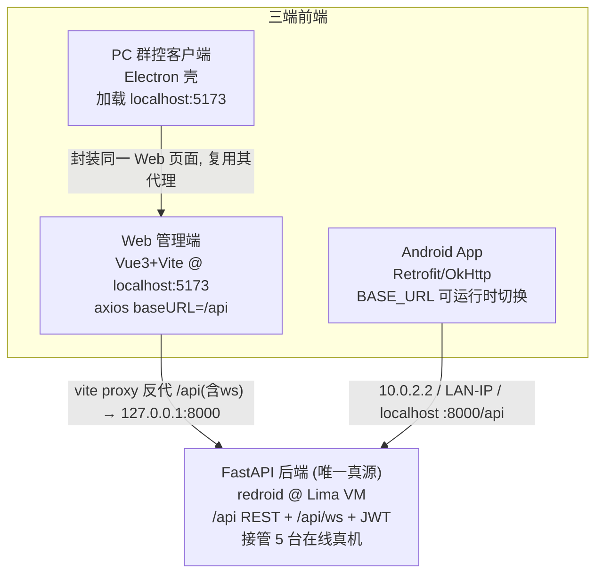

# D17 三端联调 Runbook（Web + PC + App）

本文档说明 **Web 管理端**、**PC 群控客户端（Electron）**、**Android App 客户端** 三端如何
连接**同一套 FastAPI 后端**完成联调，以及各端的启动步骤、地址配置与数据一致性验证。

> 核心结论：三端都只是"前端壳"，业务逻辑、设备状态、鉴权、操控全部在**同一个后端**。
> 任一端下发的操作（打开网页 / 回主页 / 批量等）会通过同一后端作用到同一批真机上，
> 其他两端刷新即可看到一致结果。这就是"三端数据天然一致"的由来。

---

## 1. 拓扑总览

```
                         ┌───────────────────────────────────────────────┐
                         │            FastAPI 后端（唯一真源）             │
                         │   redroid 模式，跑在 Lima VM 内                 │
                         │   REST:  /api/*      鉴权: JWT (admin/admin123) │
                         │   实时:  /api/ws     推送: device_status/preview│
                         │   接管 5 台在线真机（ADB / scrcpy 截图帧）      │
                         └───────────────▲───────────────▲───────────────┘
                                         │               │
                  ssh 隧道                │ HTTP+WS       │ HTTP+WS       局域网/隧道
   本机: 127.0.0.1:8000  ────────────────┘               └──────────────  <host-ip>:8000
                                         │
        ┌────────────────────────────────┼────────────────────────────────┐
        │                                │                                 │
┌───────┴────────┐              ┌────────┴─────────┐              ┌─────────┴────────┐
│  Web 管理端     │              │  PC 群控客户端    │              │  Android App     │
│  Vue3 + Vite    │              │  Electron 壳     │              │  Kotlin/Compose  │
│  localhost:5173 │◄─── 封装 ────│  main.js 加载     │              │  Retrofit/OkHttp │
│  axios baseURL  │   同一 URL   │  localhost:5173   │              │  BASE_URL 可切换  │
│  = '/api'       │              │  （= 复用 Web）   │              │                  │
│  vite proxy 反代 │              │                  │              │                  │
│  /api → :8000   │              │                  │              │                  │
└─────────────────┘              └──────────────────┘              └──────────────────┘
        Web 与 PC 共用 5173，PC 只是把同一个页面装进桌面窗口；
        App 是独立原生端，直接按 BASE_URL 访问后端。
```

Mermaid 版（支持的渲染器可直接预览）：



---

## 2. 后端（唯一真源）

- 运行形态：redroid 模式，跑在 Lima VM 内，已通过 ssh 隧道映射到本机 `127.0.0.1:8000`。
- API 前缀：`/api`；WebSocket：`/api/ws`。
- 登录：`admin / admin123`。
- 当前有 **5 台真机在线**。

联调前先自检后端可达（注意本机系统代理会劫持 localhost，curl 必须绕过代理）：

```bash
# 关键：--noproxy '*' 绕过系统代理，否则 localhost 请求会被代理劫持
curl -s --noproxy '*' -X POST http://127.0.0.1:8000/api/auth/login \
  -H 'Content-Type: application/json' \
  -d '{"username":"admin","password":"admin123"}'
# 期望：返回 {"access_token":"...","token_type":"bearer","user":{...}}
```

带上 token 看设备列表，确认 5 台在线：

```bash
TOKEN=$(curl -s --noproxy '*' -X POST http://127.0.0.1:8000/api/auth/login \
  -H 'Content-Type: application/json' \
  -d '{"username":"admin","password":"admin123"}' | python3 -c 'import sys,json;print(json.load(sys.stdin)["access_token"])')
curl -s --noproxy '*' http://127.0.0.1:8000/api/devices \
  -H "Authorization: Bearer $TOKEN" | python3 -m json.tool | head -40
```

> 代理陷阱：本机系统代理会劫持 localhost。命令行用 `--noproxy '*'`（curl）或
> `NO_PROXY=127.0.0.1,localhost` / httpx `trust_env=False`。浏览器/Electron 走系统栈，
> 通常已对 localhost 直连；若异常可在系统代理设置里把 `localhost, 127.0.0.1` 加入排除列表。

---

## 3. Web 管理端（localhost:5173）

Vue3 + Vite。前端所有请求用 `axios baseURL = '/api'`（见 `frontend/src/api/client.js`），
由 Vite dev server 把 `/api`（含 WebSocket）反代到后端：

```js
// frontend/vite.config.js
server: {
  port: 5173,
  proxy: { '/api': { target: 'http://127.0.0.1:8000', changeOrigin: true, ws: true } },
}
```

启动：

```bash
cd frontend
corepack enable     # 仅首次；Node 需 ≥ 22.13
pnpm install        # 仓库锁文件是 pnpm-lock.yaml，勿用 npm install
pnpm run dev        # 监听 5173
```

在浏览器打开 http://localhost:5173 → 用 `admin/admin123` 登录 → 应看到 5 台真机、可预览与操控。

> 端口绑定注意：本机 Vite 实际监听在 **IPv6 `[::1]:5173`**。
> 用主机名 `localhost` 访问正常（解析到 ::1）；用 `127.0.0.1:5173`（IPv4）可能连不上。
> 因此 PC 客户端与浏览器都应使用 `http://localhost:5173`，不要写成 `127.0.0.1`。
> 后端隧道相反，监听在 IPv4 `127.0.0.1:8000`，而 Vite 代理 target 正是 `http://127.0.0.1:8000`，两者匹配。

---

## 4. PC 群控客户端（Electron 封装 Web）

PC 端不是重写，而是把上面的 Web 管理端整体装进桌面窗口（`pc-client/main.js`）：
开发模式加载 `ELECTRON_START_URL`（默认 `http://localhost:5173`），即**复用同一个 Vite dev server、
同一套代理、同一个后端**。因此 PC 端与 Web 端看到的数据、可执行的操作完全一致。

前置：后端(第2节)与 Web dev server(第3节)已在运行。

```bash
cd pc-client
npm install         # 首次会下载 Electron 运行时二进制（较大，耐心等待）
npm run dev         # = cross-env ELECTRON_START_URL=http://localhost:5173 electron .
```

`npm run dev` 会弹出 1400×900 桌面窗口，自动打开 DevTools，加载 http://localhost:5173。
登录后即可像 Web 端一样群控这 5 台真机。

加载策略（`main.js`）：

| 场景 | 加载来源 |
|---|---|
| 开发（`npm run dev`） | `ELECTRON_START_URL` = `http://localhost:5173`（Vite dev server） |
| 已构建未打包（`npm start`，无 ELECTRON_START_URL） | `../frontend/dist/index.html` |
| 打包安装后 | 随包分发的 `resources/frontend/index.html`（打包时把 `frontend/dist` 作为 extraResources 打入） |

> Vite 端口非 5173 时：`ELECTRON_START_URL=http://localhost:<port> npm start`。
> 打包出 Windows exe：`cd pc-client && npm run dist`（先构建 frontend，再 electron-builder --win）。
> 打包产物内自带前端页面，演示机只要能访问后端 8000 端口即可。

安全基线（已在 `main.js` webPreferences 落实）：`contextIsolation: true` + `nodeIntegration: false`
+ `sandbox: true`，渲染进程仅通过 `preload.js` 暴露的最小桥 `window.cloudPhoneDesktop`
（版本号 / 平台 / openExternal）访问原生能力。

---

## 5. Android App 客户端

独立原生端（Kotlin + Compose + Retrofit/OkHttp），不复用 Web 页面，而是直接按 `BASE_URL`
访问后端 `/api`。地址有两处可配置（详见 `app-client/README.md`）：

1. 编译期默认：`app/build.gradle.kts` → `buildConfigField("String","BASE_URL", ...)`，
   默认 `http://10.0.2.2:8000/api/`。
2. 运行时覆盖：登录页顶部"服务器地址"输入框（`LoginViewModel` 登录前调 `ApiClient.setBaseUrl`），无需重编。

**BASE_URL 按运行环境取值**（关键映射）：

| App 运行环境 | 后端相对位置 | BASE_URL |
|---|---|---|
| Android 模拟器（跑在这台 Mac 上） | 后端隧道在宿主机 8000；`10.0.2.2` = 模拟器眼中的宿主机回环 | `http://10.0.2.2:8000/api/` |
| 真机 + 与后端同一局域网 | 直连后端所在主机的 LAN IP | `http://<host-lan-ip>:8000/api/`（如 `http://192.168.1.10:8000/api/`） |
| 就在这台 Mac 上跑（经隧道，罕见） | 本机回环即隧道口 | `http://localhost:8000/api/` |

> demo 后端为 HTTP 明文，Manifest 已开 `usesCleartextTraffic="true"`；生产切 HTTPS 后移除。

登录同一 `admin/admin123`、指向同一后端后，App 看到的也是同一批 5 台真机，与 Web/PC 一致。

---

## 6. 一致性验证（联调收尾）

同时开三端并指向同一后端，做一次交叉验证：

1. **同源确认**：三端都用 `admin/admin123` 登录，设备列表应是**同样的 5 台**（名称/机型/状态一致）。
2. **写操作跨端可见**：在 PC 端对某台设备"打开网页"或"回主页" → 切到 Web 端刷新该设备预览，
   画面应同步变化；在 App 端对同一台再操作 → PC/Web 端预览同样跟随变化。
3. **批量一致**：Web 端批量"回主页"后，App 端与 PC 端刷新列表，被操作设备状态一致。
4. **实时推送**：Web/PC 端通过 `/api/ws` 收到 `device_status/preview/batch_progress` 推送即时刷新；
   App 端 demo 走 REST 轮询（列表 5s、详情 1.5s），略有延迟属预期，最终态一致。

> 之所以天然一致：三端没有各自的本地业务状态，读写都落到**同一个后端 + 同一批真机**。
> 前端差异只在传输方式（Web/PC 走 Vite 代理 + WS；App 走 Retrofit REST），不影响数据源。

---

## 7. 常见问题排查

| 现象 | 排查 |
|---|---|
| curl localhost 超时/被劫持 | 系统代理劫持 localhost，加 `--noproxy '*'` 或 `NO_PROXY=127.0.0.1,localhost` |
| Web `127.0.0.1:5173` 连不上但 `localhost:5173` 正常 | Vite 绑在 IPv6 `[::1]`，统一用 `localhost` |
| Electron 白屏/加载失败 | 确认 Vite dev server 已在 5173 且 `ELECTRON_START_URL=http://localhost:5173` |
| PC 端登录成功但无设备 | 确认后端隧道 `127.0.0.1:8000` 存活、5 台真机在线（第2节自检） |
| App 模拟器连不上后端 | 用 `10.0.2.2` 而非 `localhost`（模拟器里的 localhost 是它自己） |
| App 真机连不上 | 用后端主机 LAN IP，且手机与主机同网段、后端监听 `0.0.0.0` |
