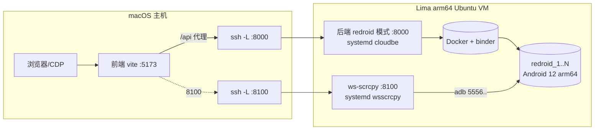

# 系统架构图

## 总体架构

```mermaid
flowchart TB
  subgraph 接入端
    W[Web 控制台<br/>Vue3+Element Plus]
    P[PC 客户端<br/>Electron]
    A[App 客户端<br/>Kotlin/Compose]
  end
  subgraph 平台后端[平台后端 FastAPI]
    AUTH[鉴权 JWT + RBAC 四级]
    DEV[设备/分组/应用/分辨率]
    CTRL[单机操控 + 批量/同步(1控N)]
    SCR[脚本 录制/编辑/回放 + 定时任务]
    MON[看板/告警/报表/日志/审计]
    WS[WebSocket 状态·进度·预览帧]
  end
  subgraph 编排[DeviceBackend 抽象]
    SIM[SimulatorBackend<br/>内存态+SVG预览]
    RED[RedroidBackend<br/>Docker SDK+adb+screencap]
  end
  subgraph 实例[真实实例 · Linux/VM]
    R1[(Redroid Android 12<br/>Chromium/WebView + iOS皮肤)]
    SC[ws-scrcpy<br/>H.264 浏览器投屏]
  end

  W & P & A -->|REST /api + WS /api/ws| 平台后端
  平台后端 --> AUTH & DEV & CTRL & SCR & MON & WS
  平台后端 -->|CLOUD_DEVICE_BACKEND| 编排
  编排 --> SIM
  编排 --> RED
  RED -->|docker run + adb| R1
  W -.->|高清投屏 iframe/新窗| SC
  SC -->|scrcpy-server 推流| R1
```

## 本机(Apple Silicon)真机部署拓扑



要点：后端与 redroid 同处 VM；Mac 经 ssh 隧道接入 8000(平台)/8100(投屏)。切 `CLOUD_DEVICE_BACKEND=redroid↔simulator` 即可在真机/模拟间切换，业务代码零改动。
